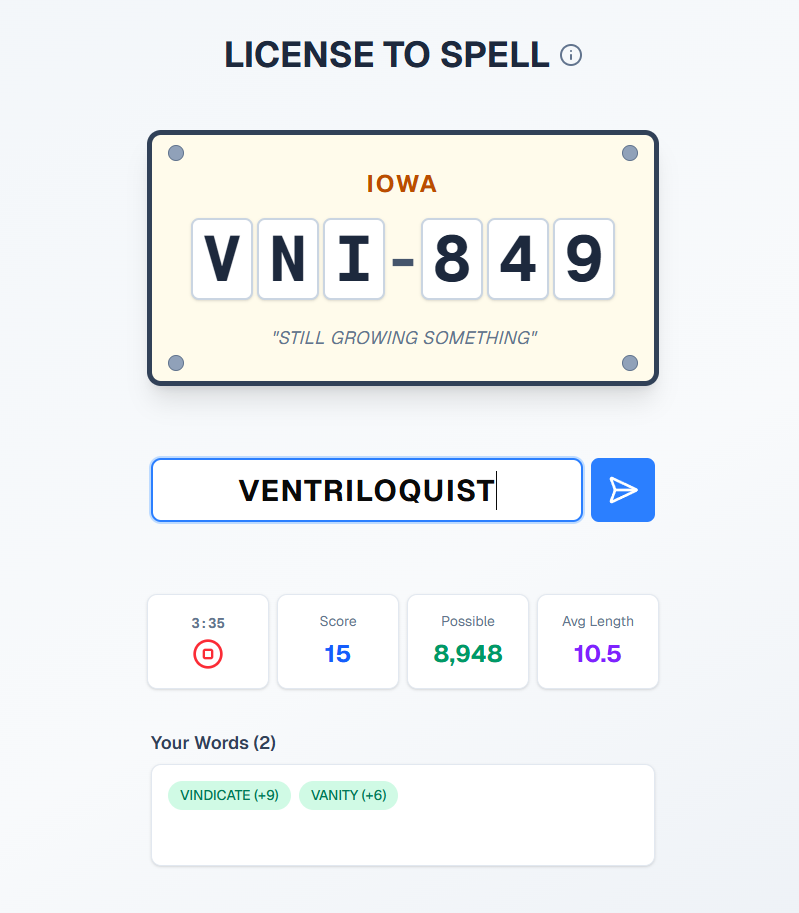

# License To Spell

## Overview

License To Spell is a word game where the goal is to spell as many words as possible given a license plate. Words must start with the first letter of the license plate and every letter in the license plate must appear in the word at least once, in the same order.

The license plate number indicates how many words are possible to create.

License Plate Format: ABC123

Example: BAM123

There are 123 possible words to create.

- ✓ BECAME
- ✗ BEMOAN (A must come before M)
- ✗ EMBALM (B must come first)

## Scoring

Each valid word scores points equal to its length. A 5-letter word = 5 points, an 8-letter word = 8 points, etc.

## Tech Stack

- TypeScript
- Next.js (app router, API routes, etc.)
- Tailwind CSS
- Shadcn UI
- Vitest / Playwright

---

